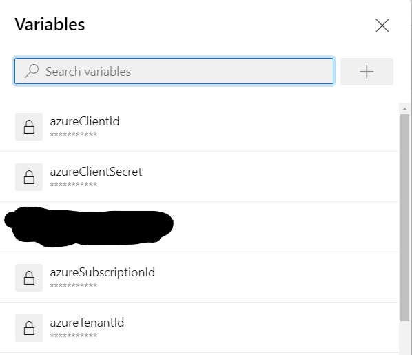

## Running terraform in Azure using a Service Principal

This example shows how to use a 'Service Principal' authentication with Terraform in the pipeline. Four properties are needed:
- Client ID
- Client Secret
- Tenant ID
- Subscription ID

These can be passed to Terraform using environment variables or as in-line variables in Terraform. More information can be found at <a href="https://registry.terraform.io/providers/hashicorp/azurerm/latest/docs/guides/service_principal_client_secret#configuring-the-service-principal-in-terraform">Azure Provider: Authenticating using a Service Principal with a Client Secret</a>.

In order to separate code and variables (including secrets!) a simple way to do this is using variables in the Azure DevOps Pipeline. These can be injected in to the code is a pipeline step before running the actual terraform commands.

The example code uses these variables in [variables.tf](./variables.tf)
``` ini
variable "client_id" {
  type        = string
  description = "Client ID/Username for the Azure Provider"
  default     = "__azureClientId__"
}
variable "client_secret" {
  type        = string
  description = "Client Secret for the Azure Provider"
  default     = "__azureClientSecret__"
}
variable "subscription_id" {
  type        = string
  description = "Subscription ID for the Azure Provider"
  default     = "__azureSubscriptionId__"
}
variable "tenant_id" {
  type        = string
  description = "Tenant ID for the Azure Provider"
  default     = "__azureTenantId__"
}
```
In the pipeline variables the ```__*__``` variables are defined as secrets

and in a pipeline step these are replaced using this step:
``` yaml
    - task: qetza.replacetokens.replacetokens-task.replacetokens@3
      displayName: "Replace tokens in *.tf"
      inputs:
        targetFiles: |
          $(terraformDirectory)/*.tf
        actionOnMissing: fail
        tokenPrefix: "__"
        tokenSuffix: "__"
        enableTelemetry: False
```
Now a Resource group can be defined in [main.tf](./main.tf)
``` yaml
# Config to connect to our Azure Service Principal
provider "azurerm" {
  client_id       = var.client_id
  client_secret   = var.client_secret
  subscription_id = var.subscription_id
  tenant_id       = var.tenant_id
  features {}
}

resource "azurerm_resource_group" "example" {
  location = "westeurope"
  name     = "rg-example"
}
```
The complete [azure-pipelines.yml](./azure-pipelines.yml)
## Notes
The terrafrom state in this example is in the local directory. This will be deleted once the pipeline finishes, so a next run would complain about an already existing resource group. That's why the pipeline in this example also removes everything leaving an empty state.


